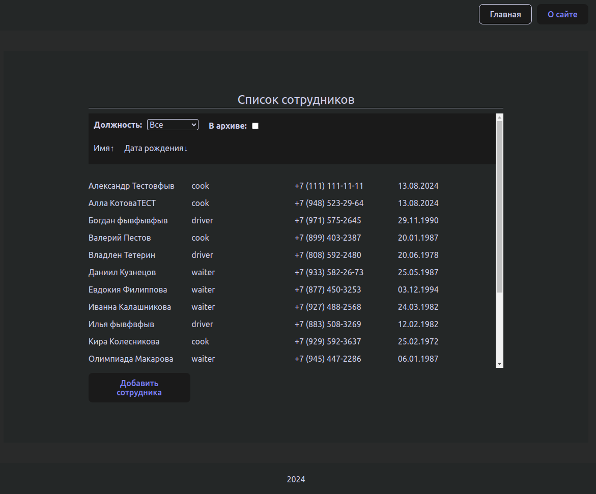

## Таблица редактирования сотрудников



### Логика работы
1. При открытии приложения отображается список сотрудников и форма для их фильтрации. У каждого из сотрудникоа в списке отображается его имя, должность и номер телефона.
   - Есть возможность сортировки списка сотрудников по имени и дате рождения.
   - Можно фильтровать сотрудников по их должности и их статусу.
3. При нажатии в списке на одного из сотрудников появляется страница с формой редактирования данных сотрудника.
4. Приложение предусматривает добавление новых сотрудников в таблицу.
5. Приложение так же поддерживает роутинг.

## Как запустить

---

### Сначала нужно установить npm пакеты

```
npm i
```

### После чего запустить

```
npm start
```

---

#### стек:

- React
- TypeScript
- Vite
- Redux Toolkit
- React Router Dom
- CSS modules

---
